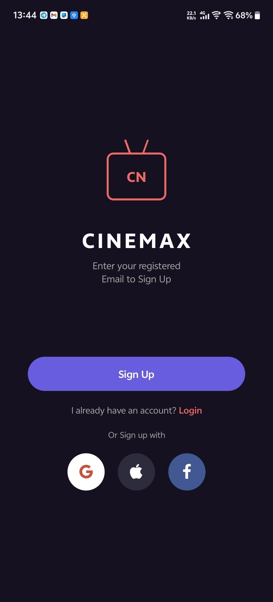
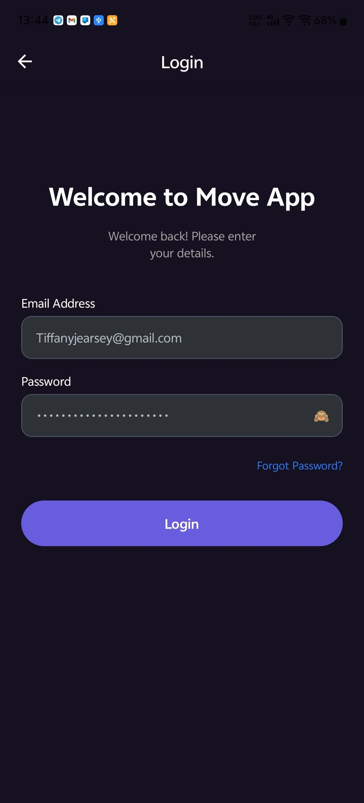
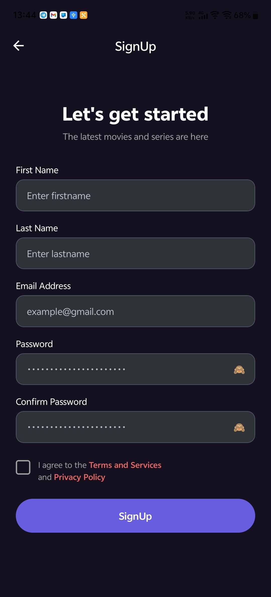
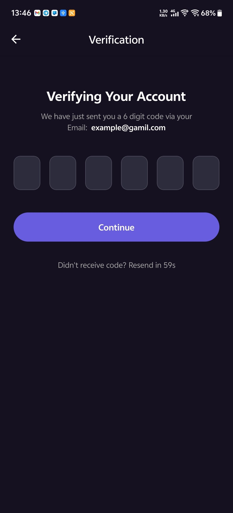
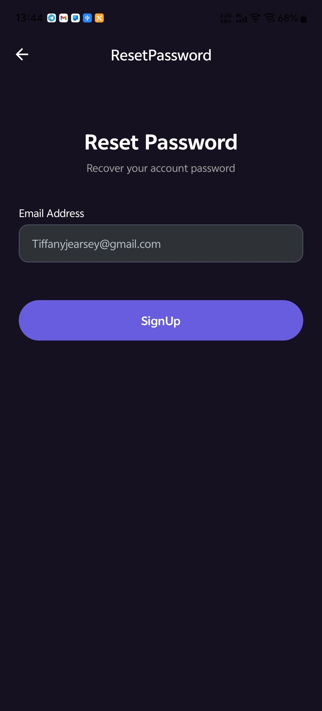
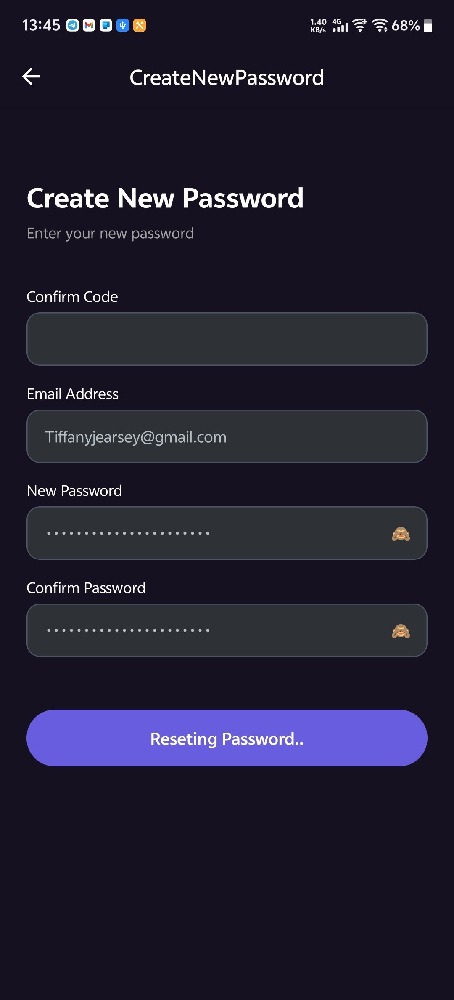
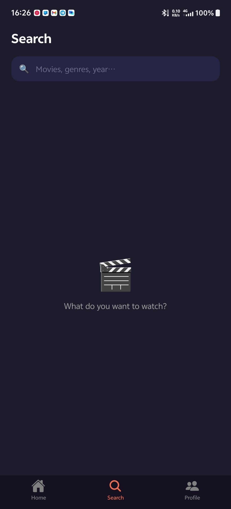
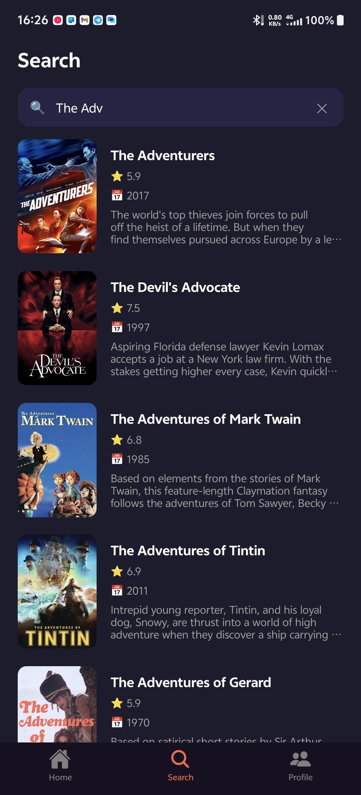
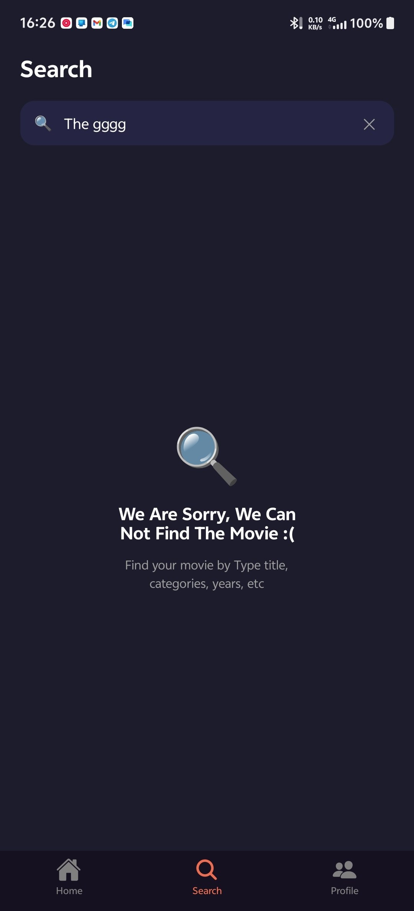

# 🎬 CINEMAX — React Native Movie App

<p align="center">
  
</p>

<p align="center">
  
  
  
  
</p>

<p align="center">
  A sleek, dark-themed mobile app for discovering movies — built with Expo & React Native.
</p>

---

## 👥 Team

| Name | GitHub | Role |
|------|--------|------|
| Keo Sophanit | [@Sophanit-Keo](https://github.com/Sophanit-Keo) | Auth & Search Screen |
| Than Sorithyreach  | [@Sorithyreach-Than](https://github.com/sorithyreach) | Home Screen |
| Chab Socheat  | [@Socheat-Chab](https://github.com/socheat1808) | Profile Screen |

---

## 📋 Table of Contents

- [Features](#-features)
- [Screenshots](#-screenshots)
- [Tech Stack](#-tech-stack)
- [Prerequisites](#-prerequisites)
- [Installation](#-installation)
- [Environment Variables](#-environment-variables)
- [Running the App](#-running-the-app)
- [Project Structure](#-project-structure)
- [Authentication Flow](#-authentication-flow)
- [API Reference](#-api-reference)
- [Contributing](#-contributing)
- [License](#-license)

---

## ✨ Features

- 🔐 **Complete Authentication System**
  - User registration with email & password
  - Email verification via 6-digit OTP
  - Login with JWT token
  - Forgot password / Reset password flow
- 📱 **Bottom Tab Navigation** — Home, Search, Profile
- 🔒 **Secure Token Storage** — stored with `expo-secure-store`
- 🔄 **Auto-Login** — Token validated automatically on app start
- 🌙 **Dark Theme** — Polished dark UI throughout
- 📡 **REST API Integration** — Backed by a Laravel REST API

---

## 📸 Screenshots
### Authentication 
| Welcome | Login | Sign Up | Verification |
|---------|-------|---------|--------------|
||  | |  |

| Reset Password | New Password |
|----------------|--------------|
| | |

### Search
| Search | Search Result  | Search Fail  |
|------|--------|---------|
|  |  |  |

### Home
| Home View 1 | Home View 2  | Home View 3  |
|------|--------|---------|
| _(screenshot)_ |_(screenshot)_ |_(screenshot)_ |

### Profile
| Search View 1 | Search View 2  | Search View 3  |
|------|--------|---------|
| _(screenshot)_ |_(screenshot)_  |_(screenshot)_|

---

## 🛠 Tech Stack

| Layer | Technology |
|-------|-----------|
| Framework | [Expo](https://expo.dev/) `~54.0.33` |
| UI Library | [React Native](https://reactnative.dev/) `0.81.5` |
| Language | [TypeScript](https://www.typescriptlang.org/) `~5.9.2` |
| Navigation | [React Navigation v7](https://reactnavigation.org/) |
| State Management | React Context API |
| Secure Storage | [expo-secure-store](https://docs.expo.dev/versions/latest/sdk/securestore/) |
| Icons | [@expo/vector-icons](https://docs.expo.dev/guides/icons/) (AntDesign, FontAwesome) |
| HTTP Client | Native `fetch` API |
| Platform | iOS · Android · Web |

---

## ✅ Prerequisites

Make sure you have the following installed before you begin:

| Tool | Version | Download |
|------|---------|----------|
| **Node.js** | >= 18.x | [nodejs.org](https://nodejs.org/) |
| **npm** | >= 9.x (comes with Node) | — |
| **Expo CLI** | latest | `npm install -g expo-cli` |
| **Git** | any | [git-scm.com](https://git-scm.com/) |

To run on a physical device:
- **Expo Go** app — [iOS](https://apps.apple.com/app/expo-go/id982107779) / [Android](https://play.google.com/store/apps/details?id=host.exp.exponent)

To run on an emulator:
- **Android Studio** (Android Emulator) — [Download](https://developer.android.com/studio)
- **Xcode** (iOS Simulator, macOS only) — [Download](https://developer.apple.com/xcode/)

---

## 📦 Installation

### 1. Clone the Repository

```bash
git clone https://github.com/Sophanit-Keo/movie-app.git
cd movie-app
```

### 2. Install Dependencies

```bash
npm install
```

### 3. Set Up Environment Variables

Copy the example environment file and fill in the values:

```bash
cp .env.example .env
```

Then open `.env` and set your API URL:

```env
EXPO_PUBLIC_API_URL=https://laravel-auth-api-opal.vercel.app/api
EXPO_PUBLIC_API_TOKEN_TMDB: your_tmdb_read_access_token_here 
```

> **Note:** The `EXPO_PUBLIC_` prefix is required by Expo to expose the variable to the app bundle.

---

## ⚙️ Environment Variables

| Variable | Description | Example |
|----------|-------------|---------|
| `EXPO_PUBLIC_API_URL` | Base URL of the backend REST API | `https://laravel-auth-api-opal.vercel.app/api` |
| `EXPO_PUBLIC_API_TOKEN_TMDB` | Get the Token form movie DB | your_tmdb_read_access_token_here |

Create a `.env` file at the project root (next to `package.json`). A template is provided at [`.env.example`](.env.example).

---

## 🚀 Running the App

Start the Expo development server:

```bash
npx expo start
```

You will see a QR code in your terminal. Then choose how to open the app:

| Method | Instructions |
|--------|-------------|
| **Expo Go (Physical Device)** | Scan the QR code with Expo Go |
| **Android Emulator** | Press `a` in the terminal |
| **iOS Simulator** _(macOS only)_ | Press `i` in the terminal |
| **Web Browser** | Press `w` in the terminal |

### Other Useful Commands

```bash
# Start with cache cleared
npx expo start --clear

# Build for Android
npx expo run:android

# Build for iOS (macOS only)
npx expo run:ios
```

---

## 📁 Project Structure

```
movie-app/
│
├── assets/                     # App icons and splash screen images
│   ├── icon.png
│   ├── adaptive-icon.png
│   ├── splash-icon.png
│   └── favicon.png
│
├── src/
│   ├── components/             # Reusable UI components
│   │   ├── AuthButton.tsx      # Custom purple action button
│   │   ├── AuthInput.tsx       # Text input with password toggle
│   │   └── MovieResultCard.tsx # Search result card with poster & meta
│   │
│   ├── context/
│   │   └── AuthContext.tsx     # Global auth state (token, login, logout)
│   │
│   ├── hooks/
│   │   └── useMovieSearch.ts   # Debounced movie search hook
│   │
│   ├── navigation/             # React Navigation configuration
│   │   ├── AuthStack.tsx       # Stack navigator for auth screens
│   │   ├── MainTap.tsx         # Bottom tab navigator (post-login)
│   │   ├── HomeStack.tsx       # Home tab stack
│   │   ├── SearchStack.tsx     # Search tab stack
│   │   └── ProfileStrack.tsx   # Profile tab stack
│   │
│   ├── network/
│   │   ├── models/             # TypeScript interfaces & types
│   │   │   ├── auth.ts         # Auth request/response types
│   │   │   └── search.ts       # Movie & search response types
│   │   │
│   │   └── services/           # API call functions
│   │       ├── authService.ts  # Auth endpoints (login, register, verify…)
│   │       └── searchService.ts# TMDB search & now-playing endpoints
│   │
│   ├── screens/
│   │   ├── auth/               # Authentication screens
│   │   │   ├── RootScreen.tsx              # Welcome / landing screen
│   │   │   ├── LoginScreen.tsx             # Login form
│   │   │   ├── SignUpScreen.tsx            # Registration form
│   │   │   ├── VerificationScreen.tsx      # OTP email verification
│   │   │   ├── ResetPasswordScreen.tsx     # Forgot password (enter email)
│   │   │   └── CreateNewPasswordScreen.tsx # Set new password
│   │   │
│   │   ├── home/
│   │   │   └── HomeScreen.tsx      # Movie home feed
│   │   │
│   │   ├── search/
│   │   │   ├── SearchScreen.tsx    # Movie search with live results
│   │   │   └── MovieDetailScreen.tsx # Full movie detail view
│   │   │
│   │   └── profile/
│   │       └── ProfileScreen.tsx   # User profile + logout
│   │
│   └── theme/
│       └── colors.ts           # App-wide color palette
│
├── App.tsx                     # Root component & navigation entry
├── index.ts                    # Expo entry point
├── app.json                    # Expo app configuration
├── tsconfig.json               # TypeScript configuration
├── .env                        # Environment variables (not committed)
├── .env.example                # Environment variable template
└── package.json                # Scripts and dependencies
```

---

## 🔐 Authentication Flow

```
App Start
    │
    ▼
AuthProvider
    │
    ├── Token exists & valid ──────────────────► MainTap (Bottom Tabs)
    │                                               ├── Home
    │                                               ├── Search
    │                                               └── Profile → Logout
    │
    └── No token / invalid ────────────────────► AuthStack
            │
            ▼
        RootScreen (Welcome)
            │
            ├── [ Sign Up ] ──► SignUpScreen
            │                       │
            │                       ▼
            │               VerificationScreen (OTP)
            │                       │
            │                       ▼
            │                   LoginScreen
            │
            ├── [ Log In ] ──► LoginScreen ──────────► MainTap ✓
            │
            └── [ Forgot Password? ]
                    │
                    ▼
            ResetPasswordScreen (enter email)
                    │
                    ▼
            CreateNewPasswordScreen (enter code + new password)
                    │
                    ▼
                LoginScreen
```

---

## 🌐 API Reference

All requests are made to the base URL defined in `EXPO_PUBLIC_API_URL`.

Authenticated endpoints require the `Authorization: Bearer <token>` header.

| Method | Endpoint | Auth | Description |
|--------|----------|------|-------------|
| `POST` | `/register` | ✅ | Register a new user |
| `POST` | `/login` | ✅ | Log in and receive a  token |
| `POST` | `/email/verify/check` | ✅ | Submit OTP to verify email |
| `POST` | `/email/verify/send` | ✅ | Resend OTP verification email |
| `POST` | `/forgot-password/send-code` | ✅ | Send password reset code to email |
| `POST` | `/forgot-password/reset` | ✅ | Reset password with code |
| `GET`  | `/user` | ✅ | Get the currently authenticated user |

### Example — Login Request

```json
POST /login
Content-Type: application/json

{
  "email": "user@example.com",
  "password": "secret123"
}
```

### Example — Login Response

```json
{
  "token": "1|AbCdEfGhIjKlMnOpQrStUvWxYz...",
  "user": {
    "id": 1,
    "first_name": "Sophanit",
    "last_name": "Keo",
    "email": "user@example.com"
  }
}
```

---

## 🤝 Contributing

Contributions are welcome! Here's how to get started:

1. **Fork** the repository
2. **Create** a new feature branch:
   ```bash
   git checkout -b feature/your-feature-name
   ```
3. **Commit** your changes:
   ```bash
   git commit -m "feat: add your feature description"
   ```
4. **Push** to your fork:
   ```bash
   git push origin feature/your-feature-name
   ```
5. **Open a Pull Request** against the `master` branch

### Commit Message Convention

This project uses [Conventional Commits](https://www.conventionalcommits.org/):

| Prefix | Use For |
|--------|---------|
| `feat:` | New features |
| `fix:` | Bug fixes |
| `style:` | UI/styling changes |
| `refactor:` | Code refactoring |
| `docs:` | Documentation updates |
| `chore:` | Build or config changes |

---

## 📄 License

This project is licensed under the **MIT License** — see the [LICENSE](LICENSE) file for details.

---

<p align="center">
  Built with ❤️ by the Cinemax Team
</p>
